<div align="center">


# WatermarkOut

### The only watermark remover you'll never have to pay for.

**Free · Private · Open Source · Runs entirely in your browser**

[](LICENSE)
[]()
[]()
[]()
[](https://github.com/IamRamgarhia/free-ai-watermark-remover/stargazers)
[](https://github.com/IamRamgarhia/free-ai-watermark-remover/issues)

[🚀 **Try it live**](https://iamramgarhia.github.io/free-ai-watermark-remover/) · [📥 Install Guide](INSTALL.md) · [💡 Why](#-why-it-exists) · [🛠 Deploy your own](#-deploy-your-own) · [🤝 Contribute](CONTRIBUTING.md)

<br>



</div>

---

WatermarkOut removes watermarks from AI-generated images (**Gemini**, **DALL·E**, **Midjourney**, **Bing Image Creator**, **Adobe Firefly**, **Meta AI**) and short videos — **entirely client-side**. The AI model runs in your browser via WebAssembly. Your files never touch any server. There is no server.

---

## 🚀 Quick start

There are **3 ways** to use WatermarkOut. Detailed steps for each in [**INSTALL.md**](INSTALL.md).

### 1️⃣ Easiest: just open the link

👉 **[https://iamramgarhia.github.io/free-ai-watermark-remover/](https://iamramgarhia.github.io/free-ai-watermark-remover/)**

1. Open the link
2. Drop in an image or video
3. Pick a preset (Gemini ✨, DALL·E, Midjourney, etc.) or draw your own rectangle
4. Click **Remove watermark**
5. Download the clean file

That's it. The file never left your browser.

### 2️⃣ Install as a real desktop app (PWA)

Visit the URL → your browser shows an "Install" icon in the address bar → click it → **WatermarkOut now has a real desktop icon and opens in its own window**. Works on Windows, macOS, Linux, iOS, Android. Zero downloads from any app store.

[📥 Full install steps per OS in INSTALL.md →](INSTALL.md#b-install-as-a-progressive-web-app-pwa--gets-a-real-desktop-icon)

### 3️⃣ Run locally (developers, offline forever, self-host)

```bash
git clone https://github.com/IamRamgarhia/free-ai-watermark-remover.git
cd free-ai-watermark-remover/static
python -m http.server 8000
# Open http://localhost:8000
```

No build step. No npm install. No compilation. Just static files.

[📥 Step-by-step in INSTALL.md →](INSTALL.md#c-run-it-locally-on-your-machine-developers-offline-forever-self-host)

---

## 💡 Why it exists

Online watermark removers charge ₹800–₹2,500 / month ($10–$30), upload your private photos to unknown servers, and add their own watermark on the free tier. WatermarkOut runs the AI **inside your browser tab** — verifiable in DevTools (Network tab stays empty after first load).

- ✅ Free forever — costs $0 to host on GitHub Pages
- ✅ Open source under MIT — fork, audit, modify
- ✅ Works offline after first visit
- ✅ Zero accounts, zero telemetry

---

## ✨ Features

| | |
|---|---|
| 🖼 Image watermark removal | JPG, PNG, WEBP, BMP — up to 100 MB |
| 🎬 Video watermark removal | MP4, WEBM, MOV — audio preserved, real-time playback preview |
| 🤖 MI-GAN inpainting | Picsart Research ICCV 2023 model, 29 MB |
| ✨ Watermark presets | Gemini, DALL·E, Midjourney, Bing, Firefly, Meta AI |
| 🎨 Manual masking | Rectangle, brush, eraser, undo |
| 🔄 BEFORE/AFTER compare | Toggle to see original vs cleaned |
| 🔒 100% offline AI | After first load, zero outbound requests |
| 📱 Installable PWA | Desktop icon, standalone window, offline support |

---

## 🖥 System requirements

- Any browser supporting WebAssembly + Service Workers:
  - Chrome / Edge 90+
  - Firefox 90+
  - Safari 16.4+ (macOS / iOS)
- ~250 MB free storage (model + app cache)
- WebGPU is auto-detected and used when available (huge speedup); falls back to WASM multi-threaded otherwise

---

## 🧩 How it works (technical)

```
┌─────────────────────────────────────────────────────────────┐
│  Your Browser Tab                                           │
│                                                             │
│  [Image] → [Canvas mask] → [MI-GAN AI (WebAssembly)]        │
│     │                            │                          │
│     │                            ▼                          │
│     └─────────────────→ [Composite result] ──→ ⬇ Download  │
└─────────────────────────────────────────────────────────────┘
                       ↑
              No server. No upload. No exit point.
```

**The model**

- [MI-GAN](https://github.com/Picsart-AI-Research/MI-GAN) (Picsart Research, ICCV 2023). A GAN-based inpainting model designed specifically for **mobile / browser deployment**.
- Exported to ONNX (29 MB) and hosted on [Hugging Face](https://huggingface.co/lxfater/inpaint-web/blob/main/migan.onnx).
- Runs via [ONNX Runtime Web](https://onnxruntime.ai/docs/tutorials/web/) with WebGPU → WebGL → WASM fallback chain.
- Cached in IndexedDB after first download — never re-downloads.

**The pipeline** (matches Picsart's official Python `demo.py`):

1. Find user's mask bounding box; crop image with context.
2. Resize crop to model's fixed 512×512.
3. Normalize image to `[-1, 1]`, mask to `1=keep / 0=inpaint` (yes, the polarity is inverted from LaMa).
4. Build 4-channel input: `[mask-0.5, R*mask, G*mask, B*mask]`.
5. Run model. Output is `[-1, 1]` float32; map to `[0, 255]` via `(v * 0.5 + 0.5) * 255`.
6. Composite into original at full resolution — only masked pixels are replaced, rest stays pixel-identical.

**Cross-Origin Isolation**

A service worker injects COOP / COEP headers so the page is `crossOriginIsolated`. This unlocks WebAssembly multi-threading + SIMD + WebGPU. Without it, inference is single-threaded WASM (~5× slower).

---

## 🛠 Deploy your own

### Option 1: GitHub Pages (recommended — free forever)

1. Fork or clone this repo.
2. Push to your own GitHub.
3. **Settings → Pages → Source: Deploy from a branch → `main` / `/static`**
4. Your site is live at `https://<username>.github.io/watermarkout/`.

### Option 2: Cloudflare Pages / Netlify / Vercel

Connect the repo, set the publish directory to `static/`, deploy. All free for static sites.

### Custom domain

1. Create a `CNAME` file in `static/` containing your domain (e.g. `watermarkout.dicecodes.com`).
2. Add a DNS CNAME record pointing to `<username>.github.io`.
3. Free HTTPS is auto-provisioned by GitHub Pages.

---

## 🧑‍💻 Local development

```bash
# Just serve the static/ folder over HTTP. ANY static server works.
cd static
python -m http.server 8000
# Then open http://localhost:8000
```

There is **no build step**. No Node, no npm, no bundler. Edit a file, refresh, see the change. The Service Worker is registered at first visit; for code changes during dev:
- `Ctrl+R` — pick up code changes (preserves the cached AI model)
- `Ctrl+Shift+R` — hard refresh (bypasses Service Worker; will redownload model)

---

## ⌨️ Keyboard shortcuts

| Key | Action |
|---|---|
| **R** | Rectangle tool |
| **B** | Brush tool |
| **E** | Eraser tool |
| **Space** | Toggle BEFORE / AFTER compare |
| **Ctrl+Z** | Undo brush stroke |
| **Esc** | Start over (with confirm) |
| **D** | Download result |

---

## 🔐 Privacy

- **No telemetry.** No analytics, no error reporting, no "anonymous usage statistics."
- **No accounts.** No email, no signup, ever.
- **No cloud.** The model fetches once from Hugging Face. After that, nothing leaves your device.
- **Auditable.** Open DevTools → Network tab → use the app → see zero requests. Source is MIT and inspectable.

---

## ⚠️ Honest limitations

| Limit | Why | Workaround |
|---|---|---|
| Image cap ~100 MB | Browser tab memory ceiling | Resize before upload |
| Short videos only (~30 s) | Per-frame processing overhead + memory | Trim long clips first |
| Model is fixed 512×512 | MI-GAN ONNX export | Internally we crop + resize for higher effective resolution at the mask |
| Static-mask video mode | One AI pass + copy patch onto all frames | Best for corner watermarks (95% case); moving content behind the watermark may show a static patch |
| Complex backgrounds (faces, fine text, architecture) | LaMa/MI-GAN inpainting limitation, not a bug | Use a tighter mask; consider desktop tools like [IOPaint](https://github.com/Sanster/IOPaint) for hard cases |
| WebGPU not in all browsers yet | Browser support catching up | Auto-falls back to WASM multi-threading |

---

## 📁 Project structure

```
watermarkout/
├── README.md
├── LICENSE
├── CONTRIBUTING.md
├── WATERMARKOUT_BUILD_SPEC.md
├── .gitignore
└── static/                  ← deploy this folder
    ├── index.html           main app
    ├── about.html           about page (DiceCodes branding)
    ├── offline.html         shown when offline & uncached
    ├── manifest.webmanifest PWA manifest
    ├── sw.js                Service Worker (offline + COI headers)
    ├── css/
    │   ├── app.css
    │   └── about.css
    ├── js/
    │   ├── app.js               main controller
    │   ├── coi-bootstrap.js     enables Cross-Origin Isolation
    │   ├── inpainter.js         MI-GAN ONNX inference
    │   ├── model-cache.js       IndexedDB model caching
    │   ├── mask.js              canvas brush/rect/eraser
    │   ├── upload.js            drag-drop, validation
    │   ├── video.js             video pipeline (decode → mask → encode)
    │   ├── fs-folder.js         File System Access API integration
    │   ├── debug.js             diagnostic helpers (no UI)
    │   ├── toast.js             notifications
    │   ├── updates.js           Service Worker update flow
    │   └── version.js
    └── assets/
        ├── logo.svg
        ├── logo-icon.svg
        ├── prince-avatar.png   (optional, falls back to GitHub avatar)
        └── icons/              PWA icons (192/512/maskable)
```

---

## 👨‍💻 About the maker

Built solo by **Prince Ramgarhia** (DiceCodes) in Batala, Punjab 🇮🇳.

> Solo-built. No VC. No growth team. Just one developer trying to make pro-grade creative tooling permanently free for everyone.

- 🌐 [dicecodes.com](https://dicecodes.com)
- 📧 [Contact@dicecodes.com](mailto:Contact@dicecodes.com)
- 🐙 [@IamRamgarhia](https://github.com/IamRamgarhia)

### Other free tools by DiceCodes

- [Free GST Billing Software](https://github.com/IamRamgarhia/Free-GST-Billing-Software)
- [SEO Tool](https://github.com/IamRamgarhia/SEO-Tool)
- [AdForge](https://github.com/IamRamgarhia/AdForge)

### Support

If WatermarkOut saved you money, time, or a privacy headache:

- **UPI (India):** `princeramgarhiaa-1@okaxis`
- **GitHub Sponsors:** [github.com/sponsors/IamRamgarhia](https://github.com/sponsors/IamRamgarhia)
- ⭐ **Star this repo** — free and helps others find it

---

## 🙏 Credits

- **[MI-GAN](https://github.com/Picsart-AI-Research/MI-GAN)** — the inpainting model (Picsart-AI-Research, ICCV 2023)
- **[ONNX Runtime Web](https://onnxruntime.ai/)** — Microsoft's browser ML runtime
- **[lxfater/inpaint-web](https://github.com/lxfater/inpaint-web)** — reference implementation we learned from
- **[Sanster/IOPaint](https://github.com/Sanster/IOPaint)** — gold-standard LaMa wrapper, source of our composite logic
- **[dinoBOLT/Gemini-Watermark-Remover](https://github.com/dinoBOLT/Gemini-Watermark-Remover)** — reference for browser-based watermark removal

---

## License

[MIT](LICENSE) — fork, modify, use commercially. Made with ❤️ in India 🇮🇳.
